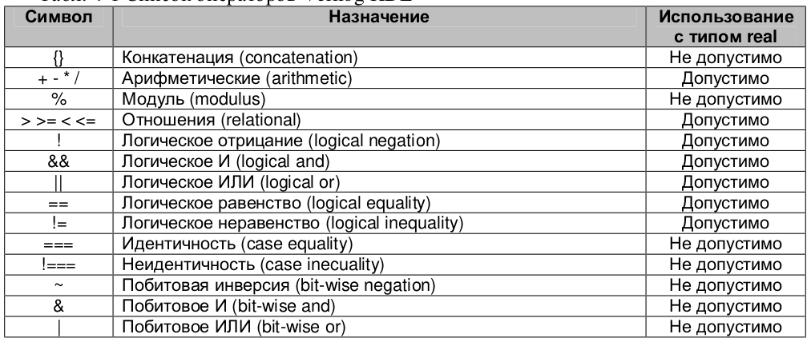
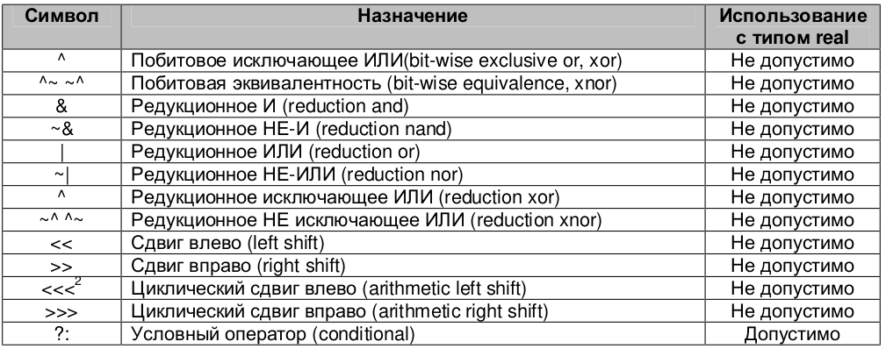
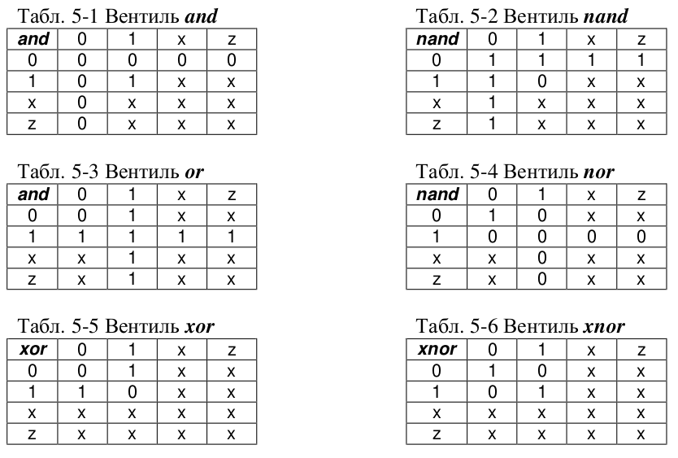
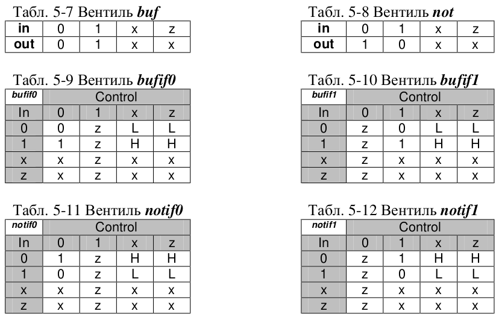
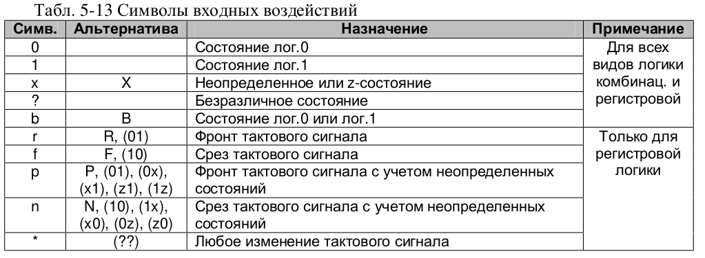

# Шпаргалка по Verilog

----

## Общее

### Комментарии

~~~verilog
//wire s0 = Rc0;
/* много букАв */
~~~

### Константы

~~~verilog
//[размер]['система счисления] значение константы
99 //десятичное
6'b1010 //шестиразрядное бинарное двоичное (01010)
8'bx //восьмиразрядное неопределенное число
12'habc //двенадцати разрядная шестнадцатеричное число
~~~

### Значения сигналов 

~~~verilog
- 0 (логический 0);
- 1 (логическая 1);
- Z (состояние высокого импеданса; для применения тристабильных состояний).
- X (не задан или не определен);
~~~

### Операторы

Средствами синтеза **не** поддерживаются операторы условного равенства с учетом x или z:  **== = и !===** (в реальной схеме нет возможности сравнивать x или z).

Оператор ****** возведения в степень  (поддерживается ограниченно: только когда один из операндов равен 2).

Оператор **<=** носит название *внеблочного* назначения, значение переменной будет присвоено только в момент выхода из блока. Эти операторы **не** должны повторятся для одной и той же переменной в одной ветви алгоритма, чтобы избежать неопределенного состояния. 

Оператор **=** это *блочное* назначение или присваивание, выполняется в тот же момент где он встретился и поэтому может многократно повторятся в одной и той же ветви.

Оператор **{} конкатенации**, пример: {{a, b, c}, {3{d, e}}} эквивалентно {a, b, c, d, e, d, e, d, e}.

## Советы

> С точки зрения системы синтеза это очень важный момент: глобальные переменные как правило реализуются физически в виде цепи или регистра, в то время как локальные переменные представляют собой некоторую абстракцию, предназначенную лишь для описания алгоритма и, как правило, физически не реализуются, либо реализуются вне явном виде

> Идентификаторы портов, параметров лучше всего составлять из прописных букв, имена внутренних переменных можно прописывать строчными буквами, но начинать имя с прописной. Ключевые слова в языке Verilog всегда прописываются строчными буквами. Это не требование синтаксиса по отношению к портам и переменным, но позволяет в любом месте кода знать, с чем мы имеем дело: спортом, переменной, ключевым словом. Не надо забывать, что Verilog различает строчные и прописные буквы. 

> Имена портов или переменных на котором действуют сигналы с активным уровнем в лог.0 лучше начинать со строчной буквы n (negative), это помогает избегать ошибок, связанных с некорректным активным уровнем сигнала (значением переменной). Вместо буквы n можно использовать символ подчеркивания (_).

## Синтезируемое подмножество

### Модуль - основной объект иерархии проекта в языке Verilog

~~~verilog
module <module_name> [<list_of_ports>];
    <module_items>
endmodule 
~~~

### Объекты модуля module_items: 

- **Объявления параметров (parameter declaration) – всегда следуют за списком портов**

    Параметры - позволяют параметризовать модули.

    Параметры **не могут** быть переменными – это всегда константы.

    ~~~verilog
    parameter NBRB = 8;
    ~~~

- **Объявления входных портов (input declaration)**

    ~~~verilog
    input CE, RST, CLK; 
    ~~~

- **Объявления выходных портов (output declaration)** 

    ~~~verilog
    output [NBRB – 1:0 ] DOUT;
    ~~~

- **Объявления двунаправленных портов (inout declaration)** 

    ~~~verilog
    module bidirec (oe, clk, inp, outp, bidir);
    // Port Declaration
    input   oe;
    input   clk;
    input   [7:0] inp;
    output  [7:0] outp;
    inout   [7:0] bidir;
    
    reg     [7:0] a;
    reg     [7:0] b;
    
    assign bidir = oe ? a : 8'bZ ;
    assign outp  = b;
    
    // Always Construct
    always @ (posedge clk)
    begin
        b <= bidir;
        a <= inp;
    end
    endmodule
    ~~~
    
- **Объявления цепей (net declaration)**

    Используются для соединений внутри модуля. 

    ~~~verilog
    //Цепь: [scalared || vectored][<msb>:<lsb>] <list_of _reg_variables>
    //scalared можно использовать (читать или устанавливать) отдельные биты
    //vectored может быть прочитана или установлена лишь целиком
    //msb – старший значащий бит (most significant bit)
    //lsb – младший значащий бит (least significant bit)
    
    //Эти типы идентичны
    wire x1;//цепь имеет лишь один драйвер
    tri x2; //трех-стабильныешины.
    ~~~
    

Существуют и другие типы, но они определяются платформой.
    
- **Объявления регистров (reg declaration)** 

    Память - элементы хранения данных (ОЗУ). Элементы памяти моделируются как массивы регистров.

    ~~~verilog
    //reg [<msb>:<lsb>] <list_of _reg_variables>
    //msb – старший значащий бит (most significant bit)
    //lsb – младший значащий бит (least significant bit)
    
    reg [7:0] acc1;
    reg [0:7] acc2;
    acc1 = 8’b10000000;
    acc2 = 8’b10000000;
    
    acc1[0] вернет значение 0 (lsb);
    acc2[0] вернет значение 1 (msb);
    
    reg [7:0] temp;   // Объявление 8-разрядного регистра
    reg [3:0] data;   // Объявление 4-разрядного регистра
    
    reg [7:0] mem [0:255]; //объявление массива 256 значений по 8бит
    // Чтение битов 0-3 из 25 элементамассива mem врегистр 
    data temp = mem[24];   // Читаем элемент массива в регистр 
    temp data = temp[3:0];  // Копируем нужные биты в регистр data 
    // data = temp[0:3]  - Ошибка! Нарушен порядок
    //возрастания/убываниядиапазона регистра temp
    ~~~

    Verilog 2001 поддерживает 2-уровневые  операции по чтению объявленного массива, такие как **mem [2], [3]**. Таким  образом получаете доступ к отдельным битам считываемого байта

- **Экземпляры примитивов (primitive instantiation)** 

    Примитивы, как правило реализуют простые логические функции

    

    

    

    ~~~verilog
    module comb_block(A, B, C, D, Y);
        input A, B, C, D;
        output Y;
        wire x1, x2;
        and (x1, A, B), (x2, C, D);//примитивы
        or #5(Y, x1, x2); //#5 установка задержки на примитиве (только для моделирования)
    endmodule
    ~~~
    
- **Экземпляры модулей (module instantiation)**

     ~~~verilog
    module dreg(DIN, DOUT, CE, RST, CLK);
    	parameter NBRB = 8;
        input [NBRB – 1:0] DIN;
        input CE, RST, CLK; 
        output [NBRB – 1:0 ] DOUT;
        reg [NBRB – 1:0 ] DOUT;
    endmodule
    
    module reg_bank(DIN, DREG1, DREG2, DREG3, RG1, RG2, RG3, RST, CLK); 
        input [7:0] DIN; input RG1, RG2, RG3, RST, CLK; 
        output [7:0] DREG1; output [5:0] DREG2; 
        output [3:0] DREG3;   
        dreg Register_1 (DIN, DREG1, RG1, RST, CLK);   
        dreg #( 6) Register_2 (DIN[5:0], DREG2, RG2, RST, CLK); //Переопределение параметров (parameter override). 
        dreg #( 4) Register_3 (.CLK(CLK), .RST(RST), .DIN(DIN[3:0]), .DOUT(DREG3), .CE(RG3)); 
    endmodule
    ~~~
    
- **Непрерывные присвоения значений переменным (continious assignments)** 

    Подобное присвоение можно выполнять только для цепей. 

    Ключевое слово assign (может отсутствовать)

    ~~~verilog
    module comb_block(A, B, C, D, Y); 
        input A, B, C, D; output Y;   
        wire x1, x2;   
        assign x1 = A & B, x2 = C & D;   
        assign Y = x1 | x2; 
    endmodule 
    ~~~

- **Процесс-блоки (always blocks)** 

    Блок срабатывающий при событие (event). Для описания этих событий используются два ключевых слова **posedge** и **negedge** для того, чтобы указать с каким фронтом сигнала (переменной) данное событие связано.

    Обозначения переходов сигналов из одного состояния в другое:
	+ переходы posedge: 0->1, 0->x, 0->z, x->1, z->1
    	+ переходы negedge: 1->0, 1->x, 1->z, x->0, z->0
    
    ~~~verilog
    module dreg(DIN, DOUT, CE, RST, CLK); 
        parameter NBRB = 8; 
        input [NBRB – 1:0] DIN; 
        input CE, RST, CLK; 
        output [NBRB – 1:0 ] DOUT; 
        reg [NBRB – 1:0 ] DOUT;   
        always @(posedge CLK or posedge RST)     
            begin       
                if (RST == 1) DOUT <= ’b0;       
                else         
                    if (CE == 1) DOUT <= DIN;     
                end
    endmodule 
    ~~~
    
- **Объявление задач (процедур, tasks)** 

    + Задачи **могут** содержать элементы временного контроля – задержки, события.
    + Из тела задачи **можно** вызвать другую задачу или функцию.
    + Задача может не иметь аргументов или иметь несколько аргументов любого типа.
    + Задача **не возвращает** значений.

+ Процедура **не должна** содержать always и initial блоков;
    + Может принимать input и output

    ~~~verilog
module operation_sum_sub (in1, in2, result_sum, result_sub); 
        input [7:0] in1, in2;   // входные операнды
        output [8:0] result_sum; // результат сложения
        output [8:0] result_sub; // результат вычитания
        reg [8:0] result_sum, result_sub; // переменные
        task sub_sum_task; // объявление процедуры
            input [7:0] a, b; // входные аргументы процедуры
            output [8:0] sum, sub ; // выходные аргументы процедуры            
            begin                        
                sum = a + b ; 
                sub = a – b ;
            end 
        endtask 
        always @(in1 or in2) 
            sum_sub_task (in1, in2, result_sum, result_sub);// вызовпроцедуры
    endmodule
    ~~~
    
- **Объявление функций (function)**

    + Функция **не должна** содержать always и initial блоков;

    + Функция **не должна** содержать неблокирующие <= присваивания;

    + Внутри функций **не допускается** вызов процедур task; 

    + Функция возвращает только **одну переменную**. Возвращаемая переменная имеет тоже название, что и функция;

    + **Не принимает** аргументы такие как input и output

    ~~~verilog
    module multiplier (in1, in2, mult); 
        input [7:0] in1, in2; // входные операнды
        output [15:0] mult; // результирующее произведение
        reg [15:0] mult; // переменная
        function [15:0] mult_func;  
            input [7:0] a, b; 
            mult_func = a * b; 
        endfunction 
        always @(in1 or in2) 
            mult = mult_func (in1, in2);  
    endmodule 
    ~~~

### Объявление примитивов разработчика (user defined primitives)

Все UDPs могут иметь только один выход, причем z-состояние выхода запрещено. Примитив является самостоятельной иерархической единицей эквивалентной модулю, не допускается располагать его объявление внутри модуля.

~~~verilog
primitive <UDP_name> (<output_terminal>, <input_terminal>, ...);
    <UDP_declaration>//все порты должны быть одноразрядными
    	<UDP_output_declaration>
        [<UDP_reg_declaration>]
        <UDP_input_declaration>
    [<UDP_initial_statement>]
    	//initial <output_terminal_name> = <init_val>;
    		//init_val: 1’b0; 1’b1; 1’bx; 1; 0
    <table_definition>
    //table
    	//Различают таблицы для комбинационной и для регистровой логики
    	//combinational_entry:	
    	<level_input_list> : <output_state>;
    	//sequential_entry:
    	<level_input_list> : <state> : <next_state>;
    //endtable
endprimitive
~~~

*output_state* - описывающее состояние выхода приданной комбинации входов. 
*tate* - описывающее текущее состояние выхода примитива
*next_state* – состояние в которое выход должен перейти

Если в таблице **не обнаружено** комбинации, соответствующей входам, то выход устанавливается в неопределенное состояние.

В регистровых примитивах могут комбинироваться входные состояния для регистровой
и комбинационной логики. 

Поле выходного состояния может принимать значения 1, 0, x, X или – (символ (-) применяется только для регистровой логики и обозначает, что текущее состояние не изменяется).

### Еще один механизм для переопределения параметров

~~~verilog
module annotate;
	defparam
        reg_bank.Register_1.NBRB = 6,
        reg_bank.Register_2.NBRB = 4;
endmodule
~~~

Недостатком же является тот факт, что меняя параметры, определяющие разрядность портов он не может изменить разрядность шин, которые к этим портам подключены.

### Последовательные блоки

~~~verilog
begin : [<block_name>]  
    [<block_declaration>]  
    <block_statements> 
end
~~~

Имя блока дает механизм доступа к этим переменным на любом этапе моделирования

### Оператор ветвления if

~~~verilog
if (<cond_expr1>)  
    [begin]   
        <statements>;  
    [end] 
else if (<cond_expr2>)  
    [begin]   
        <statements>;  
    [end] 
else  
    [begin]   
        <statements>;  
    [end] 
~~~

### Операторы выбора case, casex, casez 

Оператор *casex* **игнорирует** биты отмеченные как x или z.
Оператор *casez* **игнорирует** биты в z-состоянии. 

~~~verilog
module mask_encoder(DATA, DOUT, EN); 
    input [7:0] DATA; 
    input EN; 
    output [7:0] DOUT; 
    reg [7:0] DOUT;   
    always @(DATA or EN)     
        if (EN == 1)       
            casex (DATA) 
                8’b1100_xx00: DOUT <= 8’b0000_0001; 
                8’b0110_0xx0: DOUT <= 8’b0000_0010; 
                8’b0011_00xx: DOUT <= 8’b0000_0100; 
                8’b1001_x00x: DOUT <= 8’b0000_1000; 
                8’b1010_x0x0: DOUT <= 8’b0001_0000; 
                8’b0101_0x0x: DOUT <= 8’b0010_0000; 
                8’b1111_xxxx: DOUT <= 8’b0100_0000; 
                8’b0000_0000: DOUT <= 8’b1000_0000;      
                default: DOUT <= 8’b0000_0000;       
        endcase    
    else 
        DOUT <= 8’b0000_0000;
endmodule 
~~~

### Оператор for

Следует отметить тот факт, что ни одна система синтеза **не поддерживает** бесконечные операторы и операторы у которых число циклов выполнения не представляет собой константу.

~~~verilog
module mult(ADATA, BDATA, RESULT);   
    parameter size = 8; 
    input [size-1:0] ADATA, BDATA; 
    output [2*size-1:0] RESULT; 
    reg [2*size-1:0] RESULT;   
    always @(ADATA or BDATA)     
        begin : multblk       
            integer ind; 
            RESULT = 0; 
            for (ind = 0; ind < size; ind = ind + 1)         
                if (BDATA[ind])
                    RESULT = RESULT + (ADATA << ind);     
        end 
endmodule 
~~~

# Все что ниже, является не законченным 

------

## Инструменты моделирования

### Переменные

*integer* - целое, подчиняются знаковой арифметике
*real* - вещественная (236.123_763_е-12 (Символ подчеркивания игнорируется))
*time* - целое, подчиняется без знаковой арифметике.
*event* - событие 

### Объекты модуля module_items: 

- Specify блоки (specify blocks).

    FIXME: Блоки подобного типа используются для спецификации временных задержек по путям (pathes) модуля.

- Установки начальных состояний (initial statements).

    Главное отличие таких блоков от always-блоков в том, что они выполняются один раз в самом начале моделирования, на момент времени 0. Эти блоки не поддерживаются системами синтеза (как правило), но широко используются в testbench-модулях. 
    
### Макромодули

…

### Параллельные блоки (только для моделирования)

Используются обычно с Delay control, в других случаях не имею особого смысла. 
Задержки указывают относительное время от начала выполнения блока, а не от момента выполнения какого либо оператора.

~~~verilog
fork : [<block_name>]  
    [<block_declaration>]  
    <block_statements> 
join
~~~

## Системные функции и директивы

~~~verilog
`timescale <единицы измерения>/<точность>
// аргумент <единицы измерения> определяет, в каких единицах
// будет проводиться моделирование и каких единицах будут
// измеряться задержки
// аргумент <точность> определяет с какой точностью эти задержки будут
// округляться
~~~

~~~verilog
`define WIDTH 32;        // для определения текстового макроса
`include  // для включения файла или фрагмента в исходный код
~~~

~~~verilog
$display(v1,v2,...,vn) // для вывода на экран значений переменных, строк и выражений
~~~

## Учебные материалы:

​	Видео курс по SystemVerilog, есть инфа общего характера.  [НТЦ Метротек](https://www.youtube.com/channel/UCRMROACTUVdOVWkx_PL86uA)

​	Краткий курс HDL. Язык Verilog https://kit-e.ru/hdl/kratkij-kurs/

## Примеры:

​	http://portal-ed.ru/index.php/fpga

## Инструменты:

### IDE

​	https://github.com/FPGAwars/icestudio

### Toolchain

​	https://github.com/FPGAwars/apio

## Железо:

iCE40UP5K

​	https://github.com/icebreaker-fpga/icebreaker

iCE40HX4K

​	https://github.com/FPGAwars/Alhambra-II-FPGA

